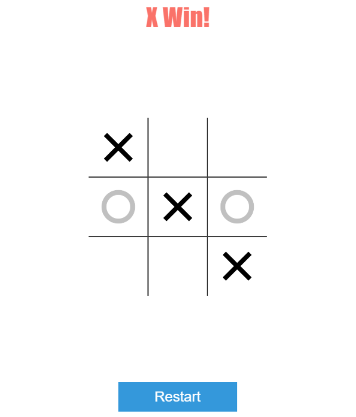
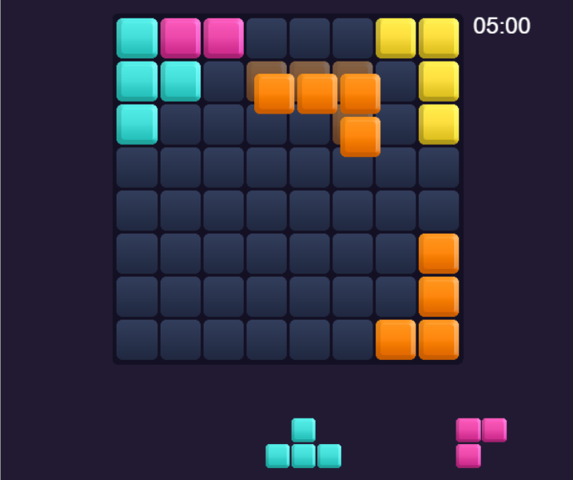

# Prototypes of web games on the Phaser game engine
Using **TypeScript**, **Node.JS**, **Webpack**, and **Phaser 3**, several prototypes of popular games were created with an architecture ready for multiplayer implementation:

## Tic-Tac-Toe
The regular version of the game of X's and Z's.

     
    

## Stack
A copy of the game Block Puzzle.

     
    

